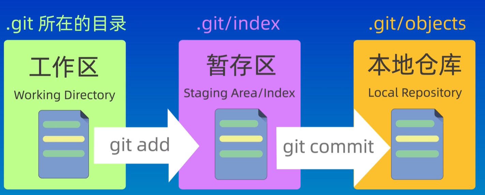
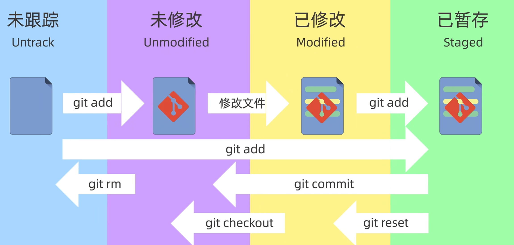

# GitNote

------

- [GitNote](#gitnote)- [GitNote](#gitnote)
  - [1. 创建仓库](#1-创建仓库)
    - [git init](#git-init)
    - [git clone](#git-clone)
  - [2. 工作区域和文件状态](#2-工作区域和文件状态)
    - [git status](#git-status)
  - [3. 添加和提交文件](#3-添加和提交文件)
    - [git add](#git-add)
    - [git commit](#git-commit)
  - [4. 撤销修改和版本回退](#4-撤销修改和版本回退)
  - [5. 查询和列出文件](#5-查询和列出文件)
    - [git ls-filess](#git-ls-filess)
  - [6. 删除文件](#6-删除文件)
  - [7. 分支相关](#7-分支相关)
  - [8. 远程仓库相关](#8-远程仓库相关)
    - [git remote](#git-remote)
      - [(1) 添加远程仓库](#1-添加远程仓库)
      - [(2) 查看远程仓库详细信息](#2-查看远程仓库详细信息)
      - [(3) 删除远程仓库](#3-删除远程仓库)
      - [(4) 重命名远程仓库](#4-重命名远程仓库)
      - [(5) 修改远程仓库URL](#5-修改远程仓库url)

## 1. 创建仓库


#### git init


#### git clone

从github上克隆一个已有仓库到本地计算机

基本语法

```cpp
git clone <远程仓库地址> [本地目录名]
```

示例

```cpp
git clone git@github.com:gls1018/CPPNote.git
```


## 2. 工作区域和文件状态

git有三个区域， 工作区，暂存区, 本地仓库

本地仓库: git init初始化或者git clone 的那个文件夹就是本地仓库，包含所有数据

暂存区: 一个临时区域，用于临时存放即将提交的修改

工作区: .git所在的目录。




在 Git 中，每个文件都可能处于以下基本状态之一：

| 状态名称             | 解释                                    | 位置     |
| -------------------- | --------------------------------------- | -------- |
| 未跟踪 (`UnTracked`) | 新建的文件，还没有被Git 跟踪            |          |
| 已暂存 (`staged`)    | 文件已经被执行`git add`命令             | 暂存区   |
| 已修改 (`Modified`)  | 文件内容已经被修改, 但还未执行`git add` | 工作区   |
| 已提交 (`commited`)  | 文件已被提交到本地仓库。                | 本地仓库 |





#### git status


## 3. 添加和提交文件

#### git add

将状态为`Untrack`和`Modified`的文件添加到`暂存区`。

基本语法：

```bash
git add <FileName>     # 添加单个文件
git add .              # 添加所有修改的文件
git add -A             # 添加所有修改和删除的文件
git add --all          # 和 -A 等价
git add <DirName>      # 添加指定目录下的所有文件
git add "*.cpp"        # 添加指定类型文件
```


#### git commit

将暂存区 (Staging Area)中的文件修改记录提交到本地仓库 (**Repository**)，形成一个新的提交版本 (Commit)。

| 命令                     | 作用                        |
| :----------------------- | --------------------------- |
| git commit -m "说明"     | 提交代码并添加说明          |
| git commit -a -m "说明"  | 提交已修改的文件 (自动 add) |
| git commit --amend       | 修改上一次提交说明          |
| git commit -v            | 提交时显示修改的详细内容    |
| git commit --allow-empty | 提交一个空记录              |
| git commit --no-verify   | 跳过钩子验证提交            |


## 4. 撤销修改和版本回退


## 5. 查询和列出文件

#### git ls-filess

`git ls-files` 是 Git 中一个**文件列表查询命令**

基本语法

```bash
git ls-files [选项] [<路径>...]
```


常用场景

| 命令            | 作用                                              |
| :-------------- | ------------------------------------------------- |
| git ls-files    | 列出暂存区中所有文件(处于`staged状态`的文件)      |
| git ls-files -m | 列出所有处于`Modified`状态的文件（-m/--modified） |
| git ls-files -o | 列出所有处于`UnTrack`状态的文件 (-o/--others)     |


## 6. 删除文件

`git rm`命令用于删除文件

**注意: 使用git rm 无法删除处于`UnTracked状态`**的文件。

基本语法

```bash
git rm [选项] <文件名>
```


下面是一些具体示例:

| 命令                    | 作用 / 影响区域                                 |
| ----------------------- | ----------------------------------------------- |
| git rm -f filename      | 删除暂存区和工作区还有本地磁盘上的文件          |
| git rm --cached fiename | 从暂存区中删除文件, 并将文件变为`Untracked`状态 |
|                         |                                                 |


## 7. 分支相关


## 8. 远程仓库相关

#### git remote

`git remote`命令主要有以下作用:

- 添加远程仓库地址
- 查看远程仓库信息
- 删除远程仓库
- 重命名远程仓库
- 修改远程仓库 URL

##### (1) 添加远程仓库

格式:

```
git remote add <远程仓库名称> <远程仓库URL>
```

例如:

```bash
git remote add origin git@github.com:gls1018/GitNote.git
```

`origin`是你给远程仓库起的名字(默认是origin)，后面的URL是远程仓库的地址。

##### (2) 修改远程仓库URL

如果远程仓库的URL发生了变化或者你需要将远程仓库迁往另一个地址，可以使用`git remote set-url`命令。

格式:

```bash
git remote set-url <远程仓库名称> <新的URL>
```

例如:

```bash
git remote set-url origin git@github.com:gls1018/NewRepo.git
```


##### (3) 删除远程仓库

如果你不需要某个远程仓库，或者需要删除它,可以使用`git remote remove`命令。

格式:

```bash
git remote remove <远程仓库名称>
```

例如:

```bash
git remote remove origin
```

这个命令只会删除远程仓库的别名,不会删除实际的远程仓库.

##### (4) 重命名远程仓库

如果你想更改远程仓库的名称,可以使用`git remote rename`命令。

格式:

```bash
git remote rename <旧的远程仓库名称> <新的远程仓库名称>
```

例如:

```bash
git remote rename origin NewName
```

##### (5) 查看远程仓库详细信息

示例:

```bash
git remote show origin
```

输出:

```cpp
* remote origin
  Fetch URL: git@github.com:gls1018/CPPNote.git
  Push  URL: git@github.com:gls1018/CPPNote.git
  HEAD branch: (unknown)
```

- Fetch URL: 拉取代码的地址
- Push URL: 推送代码的地址


#### git push


