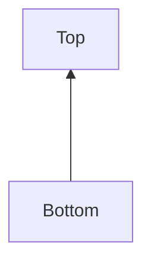
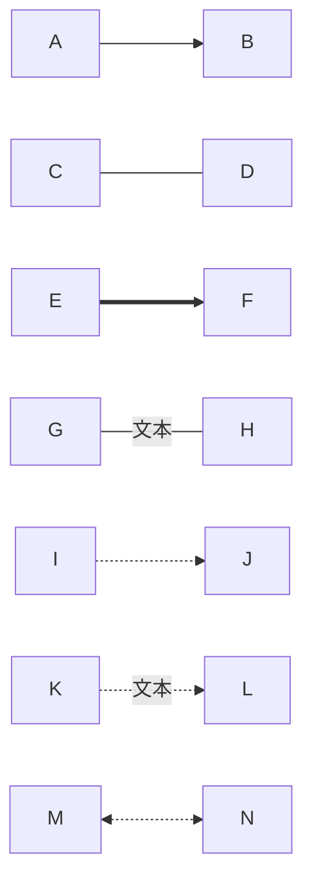
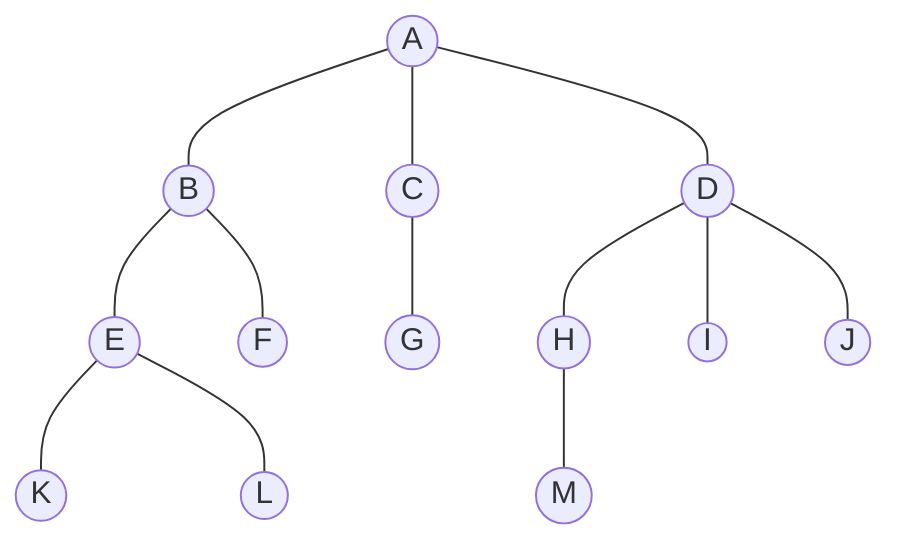

### 1. graph

#### 1.1 基本结构

- graph TD : Top to Dowm
- graph TB : Top to Bottom
- graph BT : Bottom to Top

- graph LR : Left to Right
- graph RL : Right to Left

```cpp
graph TB
    A[Top]--->B[Bottom]
```


 ```mermaid
 graph TB
 	A[Top]-->B[Bootom]
 ```

```cpp
graph BT
    A[Bottom]--->B[Top]
```



#### 1.2 节点Node

- [] : 矩形
- () : 圆角矩形
- (()): 圆形
- ([]): 体育场形
- [()] : 圆柱形
- {} ： 菱形
- [/ /] : 平行四边形


#### 1.3 连接线

- A---B：实线箭头
- C-->D: 实线无箭头
- E==>F:粗箭头
- G--文本---H： 带文字实线
- I-.->J : 虚线箭头
- K-.文本.->L： 带文字虚线
- M<-.->N :双向虚线





#### 1.4 样式


#### 1.5 事件


### 练习

#### 画二叉树



