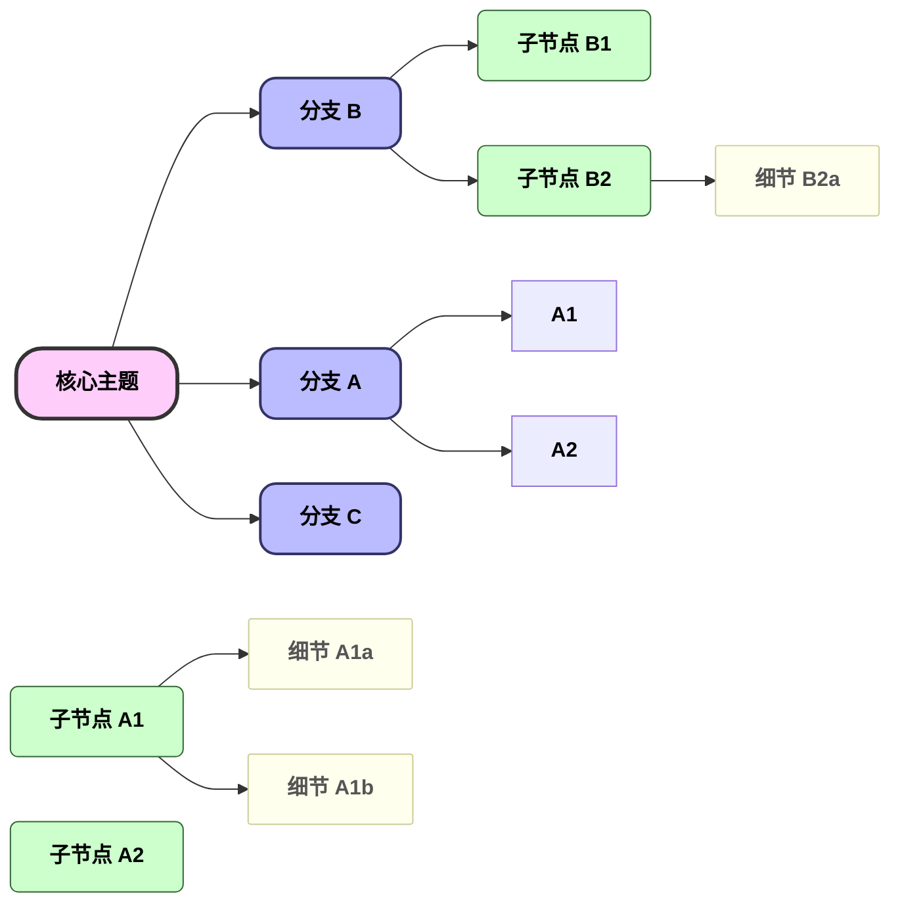

## 写作

- [Markdown]()
- [Mermaid]()
  - [各种箭头效果展示](./mermaid/arrow_appearance.md)
  - [使用mermaid模拟思维导图]()
- [LaTex]()


## 编译器相关


## Git





```mermaid
%%{init: {'flowchart': {'curve': 'basis'}}}%%
flowchart LR
    %% 根节点：深蓝，完全不透明
    classDef root fill:rgba(30,58,138,1),stroke:rgba(15,43,102,1),stroke-width:3px,color:#fff,font-weight:bold,rx:20,ry:20
    
    %% 第1级：中蓝，透明度 0.9
    classDef level1 fill:rgba(59,130,246,0.9),stroke:rgba(37,99,235,0.9),stroke-width:2px,color:#fff,rx:12,ry:12
    
    %% 第2级：浅蓝，透明度 0.75
    classDef level2 fill:rgba(147,197,253,0.75),stroke:rgba(96,165,250,0.75),stroke-width:1px,color:#000,rx:6,ry:6
    
    %% 第3级：极浅蓝，透明度 0.6
    classDef level3 fill:rgba(219,234,254,0.6),stroke:rgba(191,219,254,0.6),stroke-width:1px,color:#000,rx:2,ry:2

    Root[核心主题]:::root
    分支A[分支 A]:::level1
    分支B[分支 B]:::level1
    分支C[分支 C]:::level1
    子A1[子节点 A1]:::level2
    子A2[子节点 A2]:::level2
    子B1[子节点 B1]:::level2
    子B2[子节点 B2]:::level2
    细节A1a[细节 A1a]:::level3
    细节A1b[细节 A1b]:::level3
    细节B2a[细节 B2a]:::level3

    Root --> 分支A & 分支B & 分支C
    分支A --> 子A1 & 子A2
    分支B --> 子B1 & 子B2
    子A1 --> 细节A1a & 细节A1b
    子B2 --> 细节B2a
```


