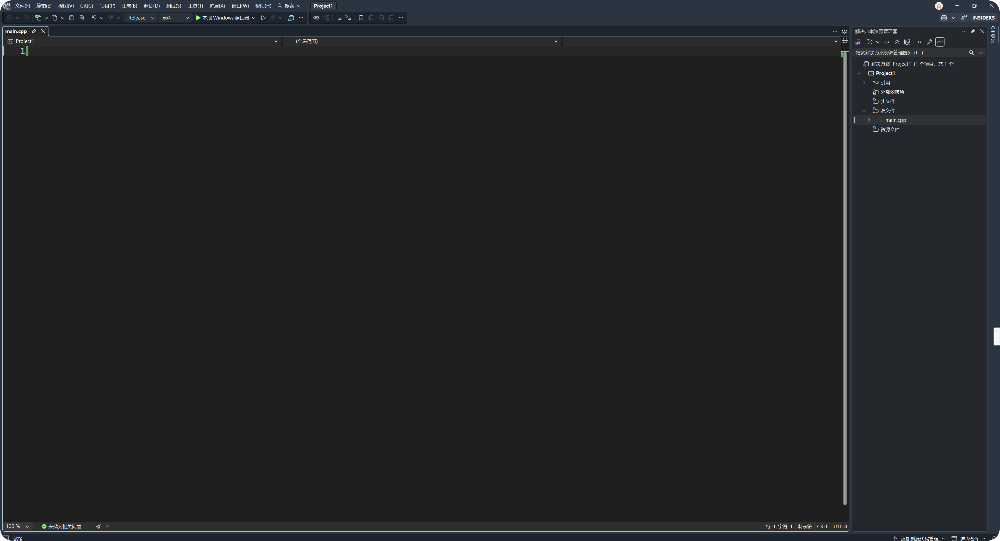
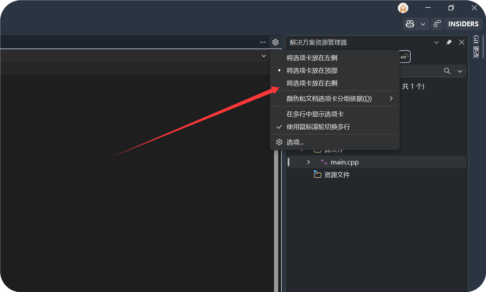
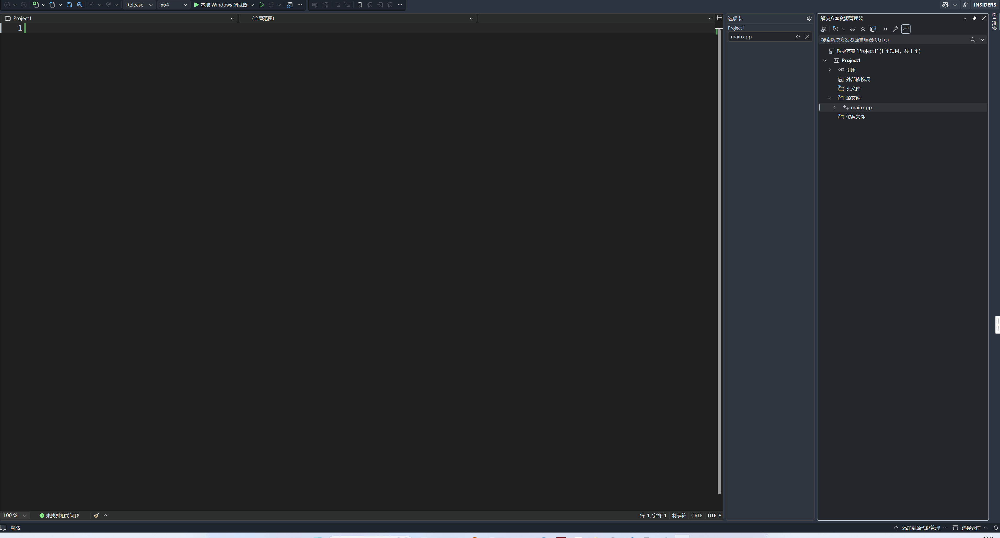

**1. VS查看对象的内存布局**

**2. 禁用警告**

- 禁用单个文件的特定警告
  
  ```cpp
  #pragma warning(disable: 4996) //禁用4996警告
  ```

- 临时禁用和恢复
  
  ```cpp
  #pragma warning(push) //保存当前警告
  #pragma warning(disable:4996)
  //产生警告的代码
  
  #pragma warning(pop) //恢复之前的警告状态
  ```

- 一次禁用多个警告
  
  ```cpp
  #pragma warning(disable: 4996 4997 4992)
  ```


**3. Win32桌面程序中文乱码**

项目-->属性--->C/C++ --> 命令行--->添加 /utf-8 


### 1. VS配置C++环境




这是初始状态

要做以下事情

- 打开cpp文件的选项卡移到右边

- 解决方案资源管理器移到左边

  

首先移动到右边



