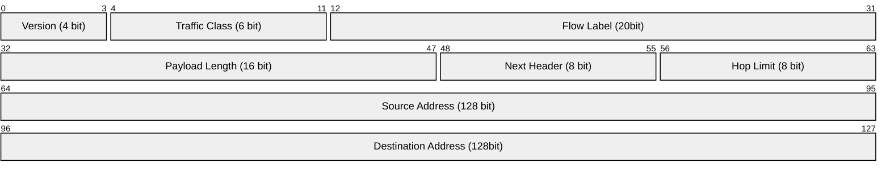
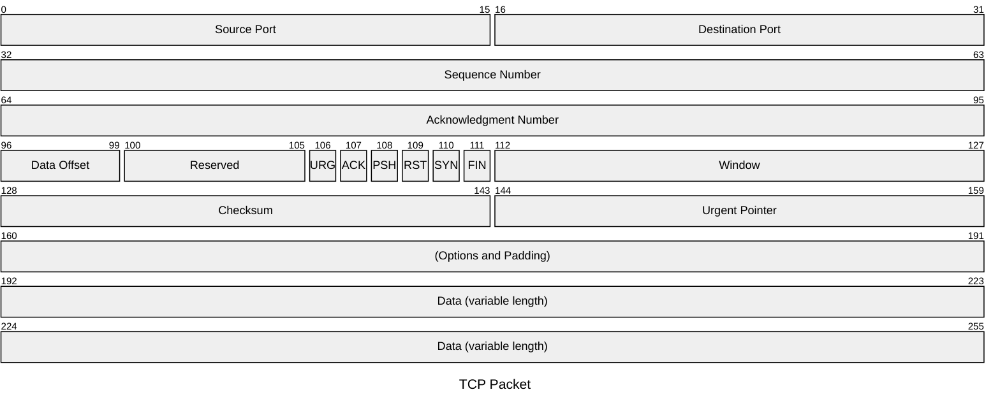

## IPv4报文格式

## 1. IPV6 数据包

```mermaid
packet

0-3: "Version (4 bit)"
4-11: "Traffic Class (6 bit)"
12-31: "Flow Label (20bit)"
32-47: "Payload Length (16 bit)"
48-55: "Next Header (8 bit)"
56-63: "Hop Limit (8 bit)"
64-95: "Source Address (128 bit)"
96-127: "Destination Address (128bit)"
```

## TCP报文格式

```mermaid

---
title: "TCP Packet"
---
packet
0-15: "Source Port"
16-31: "Destination Port"
32-63: "Sequence Number"
64-95: "Acknowledgment Number"
96-99: "Data Offset"
100-105: "Reserved"
106: "URG"
107: "ACK"
108: "PSH"
109: "RST"
110: "SYN"
111: "FIN"
112-127: "Window"
128-143: "Checksum"
144-159: "Urgent Pointer"
160-191: "(Options and Padding)"
192-255: "Data (variable length)"

```

## UDP报文格式

